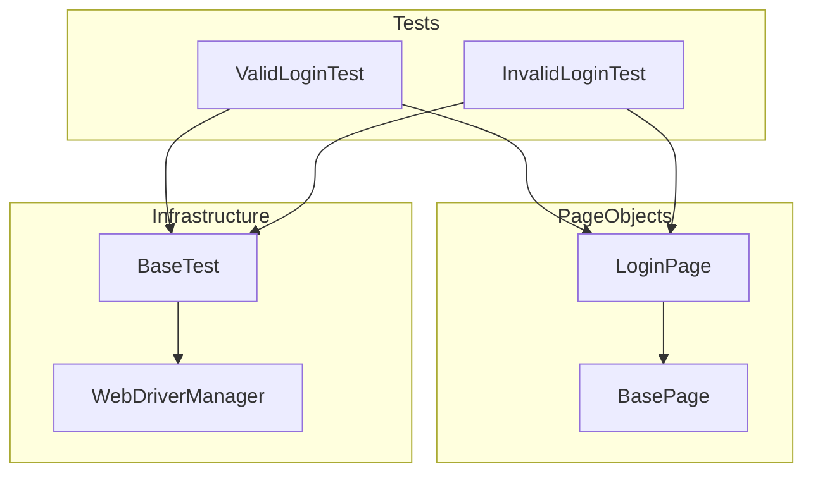

# Salesforce Login Automation Framework

An enterprise-grade Selenium automation framework built with Java, Maven, and TestNG, specifically designed for testing the Salesforce login experience.

## 🏗️ Architecture

The framework follows the **Page Object Model (POM)** pattern with a structured layering for scalability and maintainability.



## 🚀 Key Features

- **Strict XPath Locators**: Exclusively uses XPath for element identification (no CSS, ID, or Name) as per enterprise security and consistency standards.
- **Robust Synchronization**: Replaces `Thread.sleep` with fluent `WebDriverWait` for dynamic element handling.
- **Base Layering**: Includes `BasePage` and `BaseTest` to centralize synchronization, element actions, and lifecycle management.
- **Advanced Exception Handling**: Every critical action and locator is wrapped in structured `try-catch` blocks with custom error reporting.
- **TestNG Integration**: Structured test execution using `testng.xml` with priority-based test sequencing.

## 🛠️ Technology Stack

- **Lanuage**: Java 11+
- **Build Tool**: Maven
- **Test Framework**: TestNG
- **Automation Tool**: Selenium WebDriver 4
- **Driver Management**: WebDriverManager

## 📂 Project Structure

```text
Project2-RICE_POT_SeleniumFramework/
├── src/
│   ├── main/java/pages/
│   │   ├── BasePage.java       # Reusable element actions
│   │   └── LoginPage.java      # Salesforce Login Page Factory
│   └── test/java/tests/
│       ├── BaseTest.java        # Driver Setup/Teardown
│       ├── ValidLoginTest.java  # Positive Scenarios
│       └── InvalidLoginTest.java# Negative Scenarios
├── src/test/resources/
│   └── testng.xml               # Execution Suite
├── pom.xml                      # Maven Dependencies
└── README.md                    # Project Documentation
```

## 🏃 How to Run

1. **Clone the repository**:
   ```bash
   git clone https://github.com/nileshjanawade/RICE_POT_SeleniumFramework.git
   ```
2. **Execute tests via Maven**:
   ```bash
   mvn clean test
   ```
3. **Run specific suite**:
   ```bash
   mvn test -DsuiteXmlFile=src/test/resources/testng.xml
   ```

## 🛡️ Coding Standards
- **POM with PageFactory**: Standard `@FindBy` initialization.
- **Zero Placeholder Text**: All actions are validated against live elements.
- **Encapsulation**: Private WebElements for better security and structure.
