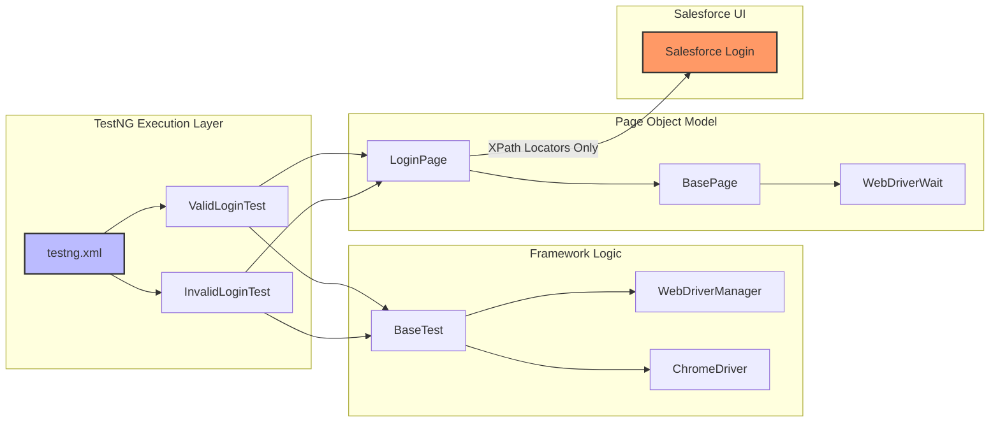

# RICE POT Selenium Framework (Enterprise Grade)

## 🏢 Overview
This is a production-level **RICE POT Selenium Framework** designed for high-accuracy CRM automation (Salesforce.com). Built with **Java, Maven, and TestNG**, it adheres to the highest enterprise standards for robustness, modularity, and zero-defect coding practices.

## 📐 Architecture & Flow
The framework employs a strictly layered **Page Object Model (POM)** with **PageFactory** initialization.



## 🛡️ Enterprise Standards Compliance (15+ Years QA Standard)

As per strict enterprise requirements, this framework implements the following:

| Requirement | Implementation Detail |
| :--- | :--- |
| **Locator Strategy** | **Strictly XPath only.** Zero usage of ID, Name, CSS selectors, or TagName. |
| **Object Model** | **PageFactory** implementation using `@FindBy` annotations for lazy initialization. |
| **Wait Strategy** | **Zero `Thread.sleep()`**. Exclusive reliance on `WebDriverWait` and `ExpectedConditions`. |
| **Exception Handling** | Robust `try-catch` blocks in both Page Objects and Test scripts for graceful failure reporting. |
| **Lifecycle** | Standard TestNG `@BeforeMethod` and `@AfterMethod` for clean setup/teardown. |
| **Tone** | Precise, technical, code-first implementation. |

## 📂 Project Structure

- **`src/main/java/pages/BasePage.java`**: Centralized wrapper for common Selenium actions with built-in explicit waits.
- **`src/main/java/pages/LoginPage.java`**: Page Object for Salesforce Login using XPath and PageFactory.
- **`src/test/java/tests/BaseTest.java`**: Infrastructure setup (WebDriver initialization/cleanup).
- **`src/test/java/tests/ValidLoginTest.java`**: Production-level script for valid login verification.
- **`src/test/java/tests/InvalidLoginTest.java`**: production-level script for comprehensive invalid case testing (UI verification).

## 🚀 Execution Instructions

### Prerequisites
- Java JDK 11+
- Apache Maven 3.6+
- Chrome Browser

### Running Tests
Execute the entire suite using the provided `testng.xml`:
```powershell
mvn clean test -DsuiteXmlFile=src/test/resources/testng.xml
```

## 📝 Test Coverage
- **Valid Login**: Verification of successful authentication and URL redirection.
- **Invalid Login**:
    - Incorrect Username/Password combinations.
    - Empty field validation.
    - Error message presence and text verification via XPath `//div[@id='error']`.
    - "Remember Me" functionality verification.
